

<!-- PROJECT LOGO -->
 

  <a href="https://github.com/your_username/repo_name">
    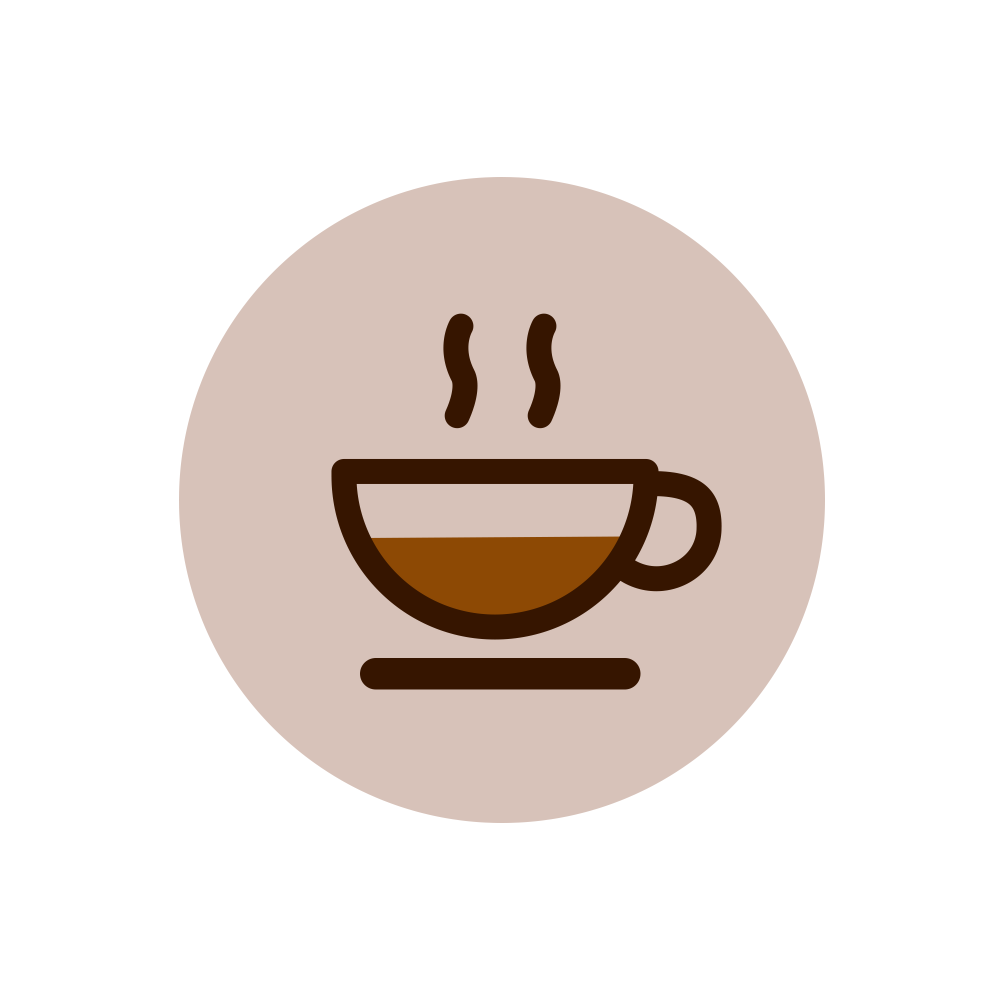
  </a>
  <h3 align="center">Tên Dự Án Của Bạn</h3>
  

    Một mô tả ngắn về dự án của bạn!
     
    <a href="https://github.com/your_username/repo_name"><strong>Khám phá tài liệu »</strong></a>
     
     
    <a href="https://github.com/your_username/repo_name">Xem Demo</a>
    ·
    <a href="https://github.com/your_username/repo_name/issues">Báo cáo lỗi</a>
    ·
    <a href="https://github.com/your_username/repo_name/issues">Yêu cầu tính năng</a>
  

<!-- TABLE OF CONTENTS -->

  
Mục lục

  <ol>
    <li>
      <a href="#about-the-project">Tổng quan về dự án</a>
      <ul>
        <li><a href="#problem-statement">Đặt vấn đề</a></li>
        <li><a href="#objectives">Mục tiêu</a></li>
        <li><a href="#significance">Ý nghĩa đề tài</a></li>
      </ul>
    </li>
    <li>
      <a href="#design">Thiết kế</a>
      <ul>
        <li><a href="#use-case-diagram">Sơ đồ use-case</a></li>
        <li><a href="#database-design">Thiết kế cơ sở dữ liệu</a></li>
      </ul>
    </li>
    <li>
      <a href="#interface">Giao diện</a>
    </li>
  </ol>

<!-- ABOUT THE PROJECT -->
<h1>Tổng quan về dự án</h1>

Ứng dụng quản lý quán cà phê Coffee Shop cung cấp các chức năng phù hợp cho cả người dùng (khách hàng) và quản trị viên (admin) như sau:

<pre>
<b>Chức năng của Người Dùng (Khách hàng):</b>

Xem Thực Đơn:
Người dùng có thể xem thực đơn của quán cà phê với các món ăn, thức uống và giá cả tương ứng.

Đặt Hàng:
Người dùng có thể đặt hàng trực tuyến thông qua ứng dụng bằng cách chọn món ăn, thức uống và thêm vào giỏ hàng

Thanh Toán:
Người dùng có thể thanh toán cho đơn hàng của mình từ giỏ hàng

Quản Lý Tài Khoản:
Người dùng có thể đăng nhập vào tài khoản của mình để theo dõi lịch sử đơn hàng, quản lý thông tin cá nhân.

<b>Chức năng của Quản Trị Viên (Admin):</b>

Quản Lý Thực Đơn:
Quản trị viên có thể thêm, sửa đổi hoặc xóa các món ăn, thức uống trên thực đơn của quán cà phê.

Quản Lý Đơn Hàng:
Quản trị viên có thể xem và quản lý tất cả các đơn hàng được đặt trực tuyến thông qua ứng dụng.

Quản Lý Khách Hàng:
Quản trị viên có thể quản lý thông tin thanh toán của khách hàng.

Thống Kê và Báo Cáo:
Quản trị viên có thể xem các báo cáo và thống kê về doanh số bán hàng, sản phẩm phổ biến, hoạt động của khách hàng, và các chỉ số quan trọng khác 
để đưa ra các quyết định kinh doanh hiệu quả.
</pre>

(<a href="#readme-top">back to top</a>)

<!-- DESIGN -->

<h1>Sơ đồ use-case</h1>

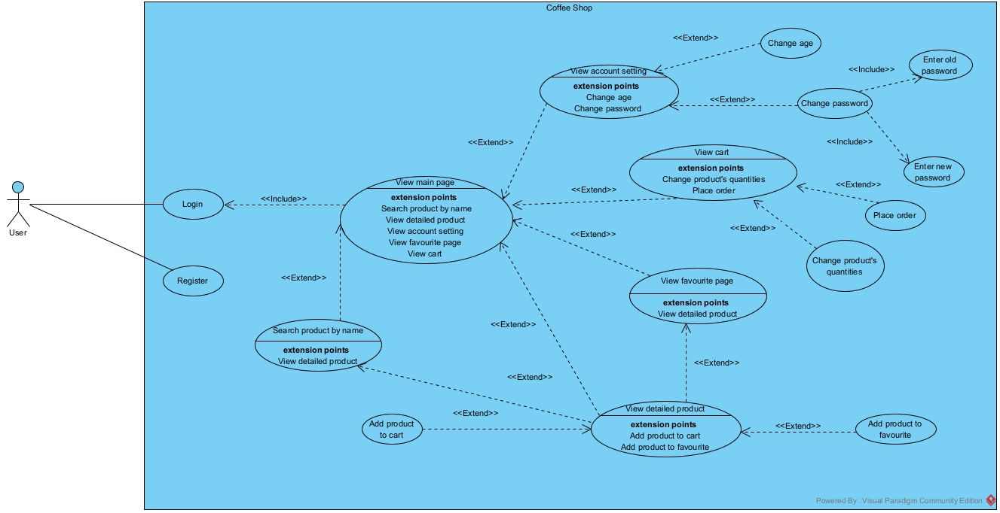
<h3 align="center">User Use-case</h3>

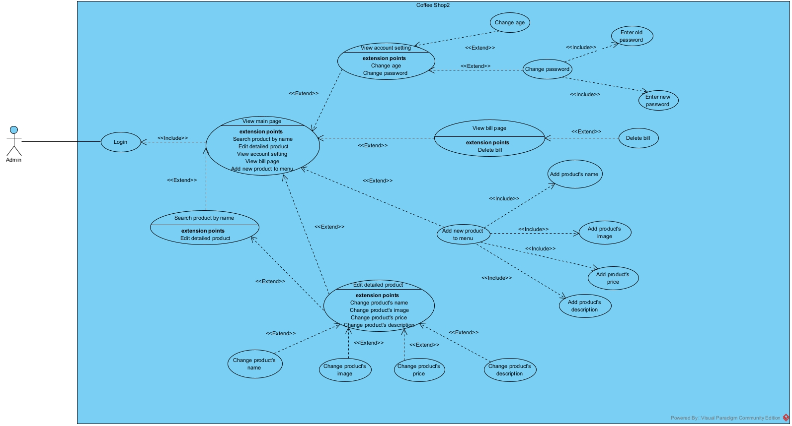
<h3 align="center">Admin Use-case</h3>

(<a href="#readme-top">back to top</a>)

<h1>Sơ đồ cơ sở dữ liệu</h1>

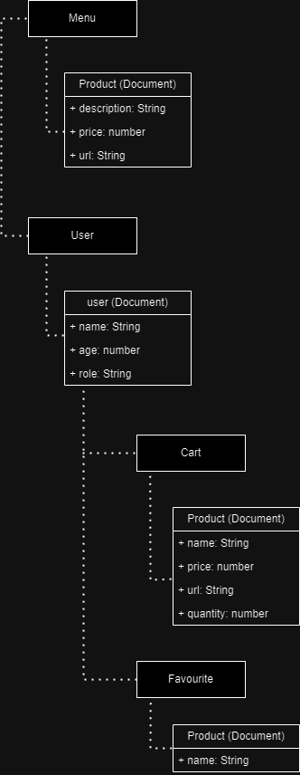

<h3 align="center">Sơ đồ database</h3>

(<a href="#readme-top">back to top</a>)

<!-- INTERFACE -->
<h1>Giao diện</h1>

<h1>Giao diện cơ bản</h1>

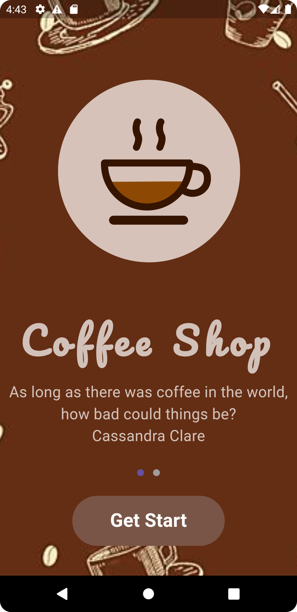

<h4 align="center">Trang welcome</h4>

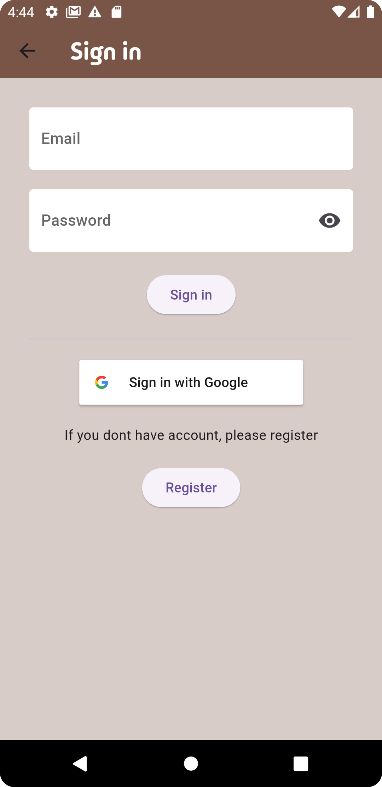

<h4 align="center">Trang sign in</h4>

<pre>
User có thể sign in bằng email hoặc sign in thông qua tài khoản Google
Admin chỉ có thể sign in bằng email
</pre>

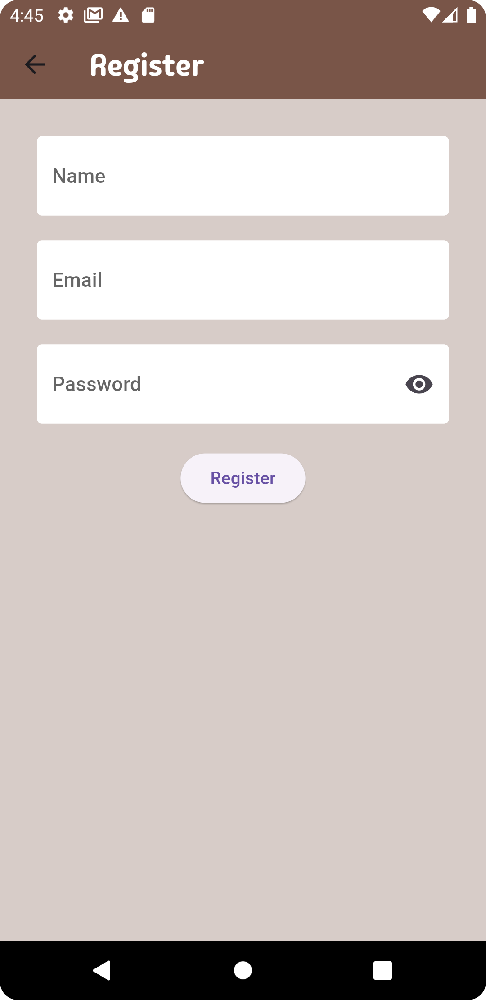

<h4 align="center">Trang Register</h4>

<h2>Giao diện khi đang nhập bằng tài khoản user</h2>

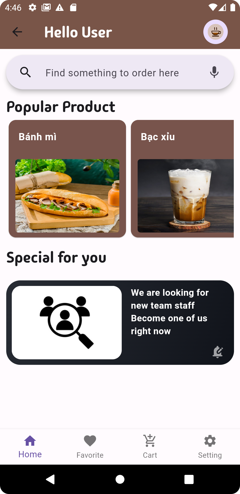

<h4 align="center">Trang chủ</h4>

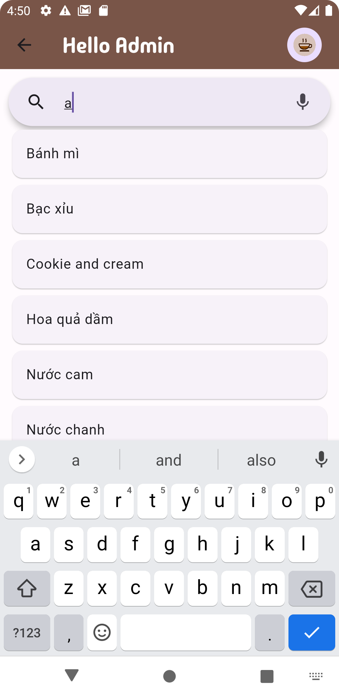

<h4 align="center">Thanh search</h4>

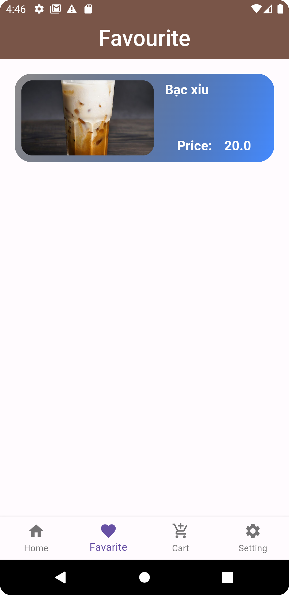

<h4 align="center">Trang favourite</h4>

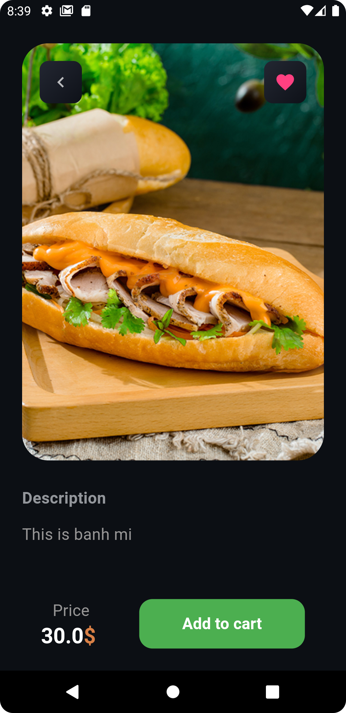

<h4 align="center">Trang chi tiết sản phẩm</h4>

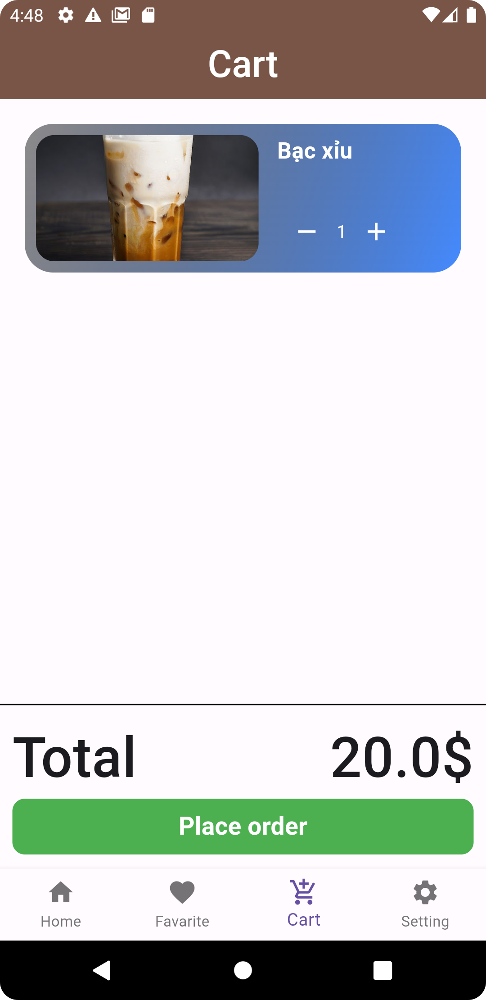

<h4 align="center">Trang giỏ hàng</h4>

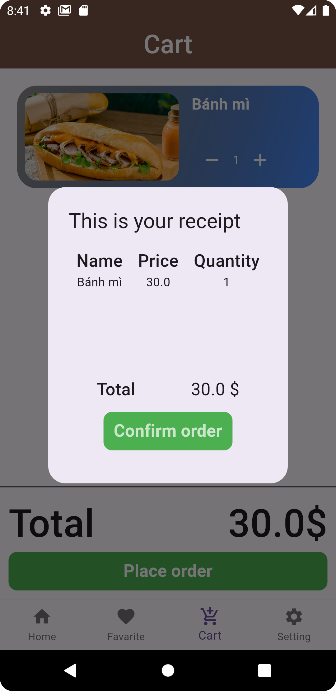

<h4 align="center">Xác nhận đặt hàng</h4>

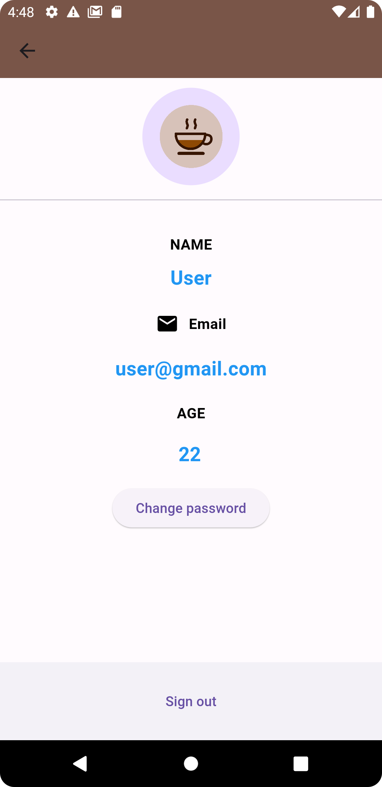

<h4 align="center">Trang thông tin tài khoản</h4>

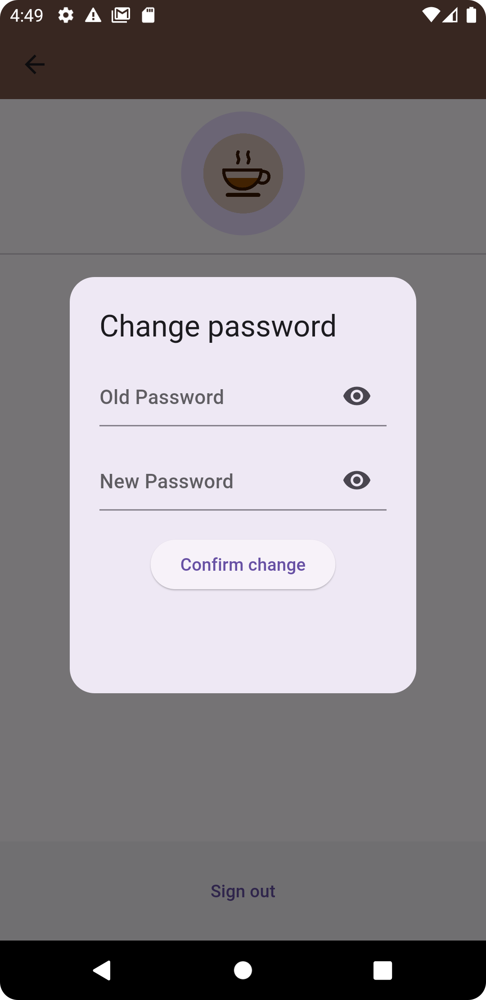

<h4 align="center">Đổi mật khẩu</h4>

<h2>Giao diện khi đang nhập bằng tài khoản admin</h2>

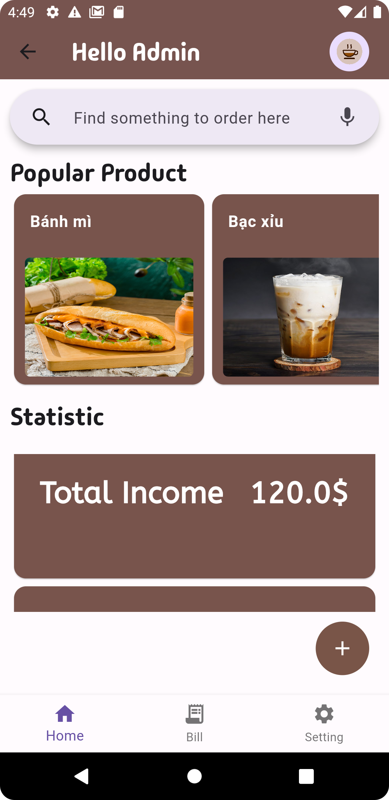

<h4 align="center">Trang chủ</h4>

<h4 align="center">Thanh search</h4>

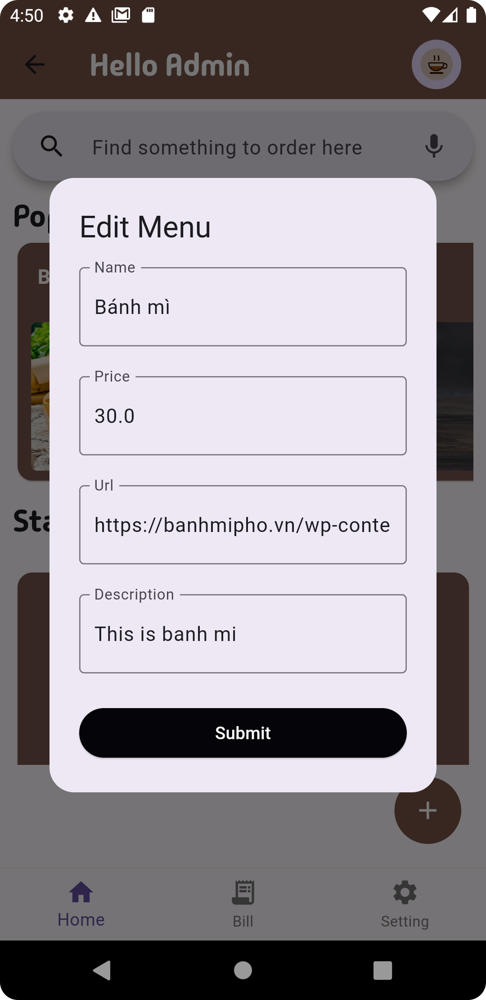

<h4 align="center">Bảng chỉnh sửa thông tin món ăn</h4>

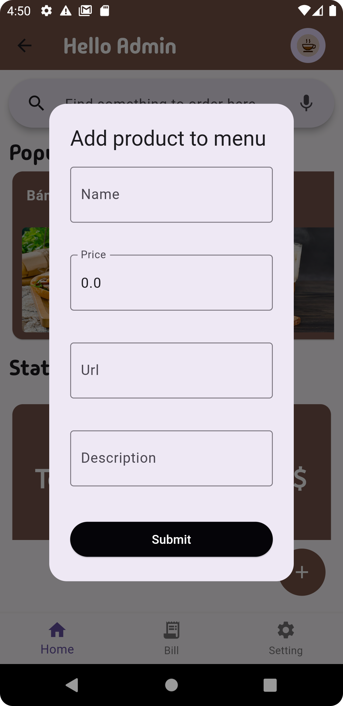

<h4 align="center">Bảng thêm món ăn</h4>

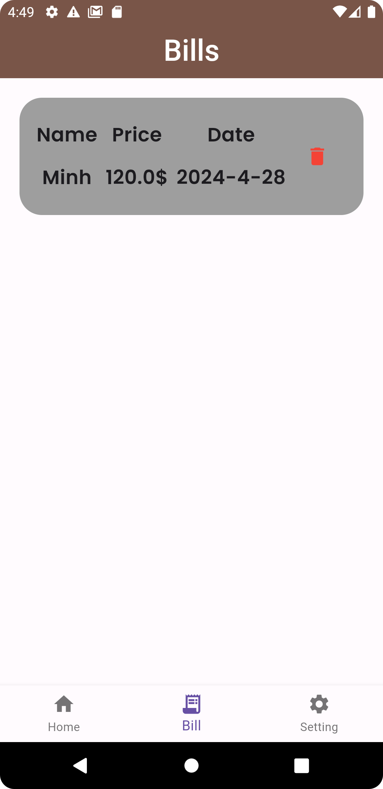

<h4 align="center">Trang danh sách hóa đơn</h4>

<h4 align="center">Trang thông tin tài khoản</h4>

<h4 align="center">Đổi mật khẩu</h4>
